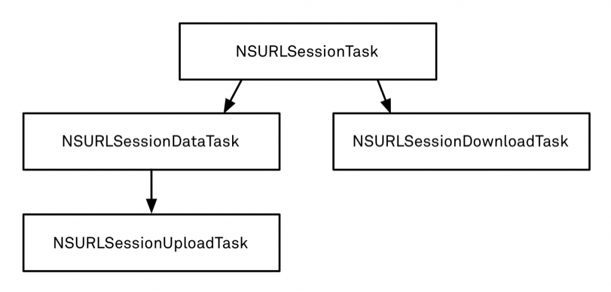

** 先贴链接：**
http://www.cocoachina.com/ios/20161018/17785.html

由于傲娇的苹果在 iOS9 之后已经放弃了 NSURLConnection，所以在现在的实际开发中，除了大家常见的 AFN 框架，一般使用的是 iOS7 之后推出的 NSURLSession，作为一名 iOS 开发人员，如果你只知道 AFN 框架来进行网络请求，那就只能说是 too young too simple,sometimes naive。

<!--more-->

#### NSURLSession 的优势
* 在处理下载任务的时候可以直接把数据下载到磁盘
* 支持后台下载|上传
* 同一个 session 发送多个请求，只需要建立一次连接（复用了TCP）
* 提供了全局的 session 并且可以统一配置，使用更加方便
* 下载的时候是多线程异步处理，效率更高
#### NSURLSessionTask 的子类
* NSURLSessionTask 是一个抽象类，如果要使用那么只能使用它的子类
* NSURLSessionTask 有两个子类
  * NSURLSessionDataTask,可以用来处理一般的网络请求，如 GET | POST 请求等
    * NSURLSessionDataTask 有一个子类为 NSURLSessionUploadTask,用于处理上传请求的时候有优势
  * NSURLSessionDownloadTask,主要用于处理下载请求，有很大的优势
  NSURLSession 的子类


#### NSURLSessionDataTask 发送 GET 请求

发送 GET 请求的步骤非常简单，只需要两步就可以完成：

1. 使用 NSURLSession 对象创建 Task
2. 执行 Task
```
//确定请求路径
 NSURL *url = [NSURL URLWithString:@"http://120.25.226.186:32812/login?username=520&pwd=520&type=JSON"];
 //创建 NSURLSession 对象
 NSURLSession *session = [NSURLSession sharedSession];

 /**
  根据对象创建 Task 请求

  url  方法内部会自动将 URL 包装成一个请求对象（默认是 GET 请求）
  completionHandler  完成之后的回调（成功或失败）

  param data     返回的数据（响应体）
  param response 响应头
  param error    错误信息
  */
 NSURLSessionDataTask *dataTask = [session dataTaskWithURL:url completionHandler:
             ^(NSData * _Nullable data, NSURLResponse * _Nullable response, NSError * _Nullable error) {

     //解析服务器返回的数据
     NSLog(@"%@", [[NSString alloc] initWithData:data encoding:NSUTF8StringEncoding]);
     //默认在子线程中解析数据
     NSLog(@"%@", [NSThread currentThread]);
 }];
 //发送请求（执行Task）
 [dataTask resume];
 ```

#### NSURLSessionDataTask 发送 POST 请求

发送 POST 请求的步骤与发送 GET 请求一样：

1. 使用 NSURLSession 对象创建 Task
2. 执行 Task
```
//确定请求路径
 NSURL *url = [NSURL URLWithString:@"http://120.25.226.186:32812/login"];
 //创建可变请求对象
 NSMutableURLRequest *requestM = [NSMutableURLRequest requestWithURL:url];
 //修改请求方法
 requestM.HTTPMethod = @"POST";
 //设置请求体
 requestM.HTTPBody = [@"username=520&pwd=520&type=JSON" dataUsingEncoding:NSUTF8StringEncoding];
 //创建会话对象
 NSURLSession *session = [NSURLSession sharedSession];
 //创建请求 Task
 NSURLSessionDataTask *dataTask = [session dataTaskWithRequest:requestM completionHandler:
             ^(NSData * _Nullable data, NSURLResponse * _Nullable response, NSError * _Nullable error) {

     //解析返回的数据
     NSLog(@"%@", [[NSString alloc] initWithData:data encoding:NSUTF8StringEncoding]);
 }];
 //发送请求
 [dataTask resume];
 ```

#### NSURLSessionDataTask 设置代理发送请求
1. 创建 NSURLSession 对象设置代理
2. 使用 NSURLSession 对象创建 Task
3. 执行 Task
```
//确定请求路径
 NSURL *url = [NSURL URLWithString:@"http://120.25.226.186:32812/login"];
 //创建可变请求对象
 NSMutableURLRequest *requestM = [NSMutableURLRequest requestWithURL:url];
 //设置请求方法
 requestM.HTTPMethod = @"POST";
 //设置请求体
 requestM.HTTPBody = [@"username=520&pwd=520&type=JSON" dataUsingEncoding:NSUTF8StringEncoding];
 //创建会话对象，设置代理
 /**
  第一个参数：配置信息
  第二个参数：设置代理
  第三个参数：队列，如果该参数传递nil 那么默认在子线程中执行
  */
 NSURLSession *session = [NSURLSession sessionWithConfiguration:[NSURLSessionConfiguration defaultSessionConfiguration]
                              delegate:self delegateQueue:nil];
 //创建请求 Task
 NSURLSessionDataTask *dataTask = [session dataTaskWithRequest:requestM];
 //发送请求
 [dataTask resume];
 ```
4. 遵守协议，实现代理方法（常用的有三种代理方法）
```
-(void)URLSession:(NSURLSession *)session dataTask:(nonnull NSURLSessionDataTask *)dataTask
didReceiveResponse:(nonnull NSURLResponse *)response
completionHandler:(nonnull void (^)(NSURLSessionResponseDisposition))completionHandler {
     //子线程中执行
     NSLog(@"接收到服务器响应的时候调用 -- %@", [NSThread currentThread]);

     self.dataM = [NSMutableData data];
     //默认情况下不接收数据
     //必须告诉系统是否接收服务器返回的数据
     completionHandler(NSURLSessionResponseAllow);
}
-(void)URLSession:(NSURLSession *)session dataTask:(NSURLSessionDataTask *)dataTask didReceiveData:(NSData *)data {

     NSLog(@"接受到服务器返回数据的时候调用,可能被调用多次");
     //拼接服务器返回的数据
     [self.dataM appendData:data];
}
-(void)URLSession:(NSURLSession *)session task:(NSURLSessionTask *)task didCompleteWithError:(NSError *)error {

     NSLog(@"请求完成或者是失败的时候调用");
     //解析服务器返回数据
     NSLog(@"%@", [[NSString alloc] initWithData:self.dataM encoding:NSUTF8StringEncoding]);
}
```

#### 设置代理之后的强引用问题
* NSURLSession 对象在使用的时候，如果设置了代理，那么 session 会对代理对象保持一个强引用，在合适的时候应该主动进行释放
* 可以在控制器调用 viewDidDisappear 方法的时候来进行处理，可以通过调用 invalidateAndCancel 方法或者是 finishTasksAndInvalidate 方法来释放对代理对象的强引用
   * invalidateAndCancel 方法直接取消请求然后释放代理对象
   * finishTasksAndInvalidate 方法等请求完成之后释放代理对象。
`[self.session finishTasksAndInvalidate];`

#### NSURLSessionDataTask 简单下载
1. 在前面请求数据的时候就相当于一个简单的下载过程，NSURLSessionDataTask 下载文件具体的步骤与上类似：
2. 使用 NSURLSession 对象创建一个 Task 请求
3. 执行请求
```
[[[NSURLSession sharedSession] dataTaskWithURL:[NSURL URLWithString:
     @"http://120.25.226.186:32812/resources/images/minion_01.png"]
     completionHandler:^(NSData * _Nullable data, NSURLResponse * _Nullable response, NSError * _Nullable error) {

     //解析数据
     UIImage *image = [UIImage imageWithData:data];
     //回到主线程设置图片
     dispatch_async(dispatch_get_main_queue(), ^{
         self.imageView.image = image;
     });

 }] resume];
 ```

#### NSURLSessionDownloadTask 简单下载
1. 使用 NSURLSession 对象创建下载请求
2. 在下载请求中移动文件到指定位置
3. 执行请求
```
//确定请求路径
 NSURL *url = [NSURL URLWithString:@"http://120.25.226.186:32812/resources/images/minion_02.png"];
 //创建请求对象
 NSURLRequest *request = [NSURLRequest requestWithURL:url];
 //创建会话对象
 NSURLSession *session = [NSURLSession sharedSession];
 //创建会话请求
 //优点：该方法内部已经完成了边接收数据边写沙盒的操作，解决了内存飙升的问题
 NSURLSessionDownloadTask *downTask = [session downloadTaskWithRequest:request
     completionHandler:^(NSURL * _Nullable location, NSURLResponse * _Nullable response, NSError * _Nullable error) {

     //默认存储到临时文件夹 tmp 中，需要剪切文件到 cache
     NSLog(@"%@", location);//目标位置
     NSString *fullPath = [[NSSearchPathForDirectoriesInDomains(NSCachesDirectory, NSUserDomainMask, YES) lastObject]  
                         stringByAppendingPathComponent:response.suggestedFilename];

     /**
      fileURLWithPath:有协议头
      URLWithString:无协议头
      */
     [[NSFileManager defaultManager] moveItemAtURL:location toURL:[NSURL fileURLWithPath:fullPath] error:nil];

 }];
 //发送请求
 [downTask resume];
 ```
以上方法无法监听下载进度，如要获取下载进度，可以使用代理的方式进行下载。

#### dataTask 和 downloadTask 下载对比
* NSURLSessionDataTask
  下载文件可以实现离线断点下载，但是代码相对复杂
* NSURLSessionDownloadTask
  1. 下载文件可以实现断点下载，但不能离线断点下载
  2. 内部已经完成了边接收数据边写入沙盒的操作
  3. 解决了下载大文件时的内存飙升问题

#### 写在最后
关于使用 NSURLSession 进行上传文件操作，我只想说真的很麻烦，建议大家时间充沛且有兴趣的可以研究一下，如果不想研究也是可以的，继续使用我们伟大的 AFN 框架就好。至于 AFN 框架的使用，这里就不赘述了，后期如果有时间会更新一些常用的 AFN 使用方法，敬请期待。

#### 附：使用 NSURLSession 上传文件主要步骤及注意点

** 主要步骤：**
1. 确定上传请求的路径（ NSURL ）
2. 创建可变的请求对象（ NSMutableURLRequest ）
3. 修改请求方法为 POST
4. 设置请求头信息（告知服务器端这是一个文件上传请求）
5. 按照固定的格式拼接要上传的文件等参数
6. 根据请求对象创建会话对象（ NSURLSession 对象）
7. 根据 session 对象来创建一个 uploadTask 上传请求任务
8. 执行该上传请求任务（调用 resume 方法）
9. 得到服务器返回的数据，解析数据（上传成功 | 上传失败）

** 注意点：**
1. 创建可变的请求对象，因为需要修改请求方法为 POST，设置请求头信息
2. 设置请求头这个步骤可能会被遗漏
3. 要处理上传参数的时候，一定要按照固定的格式来进行拼接
4. 需要采用合适的方法来获得上传文件的二进制数据类型（ MIMEType，获取方式如下）
  * [点击这里搜索](http://www.w3school.com.cn/media/media_mimeref.asp)

  * 对着该文件发送一个网络请求，接收到该请求响应的时候，可以通过响应头信息中的 MIMEType 属性得到
  * 使用通用的二进制数据类型表示任意的二进制数据  `application/octet-stream`
  * 调用 C 语言的 API 来获取

`[self mimeTypeForFileAtPath:@"此处为上传文件的路径"]`
