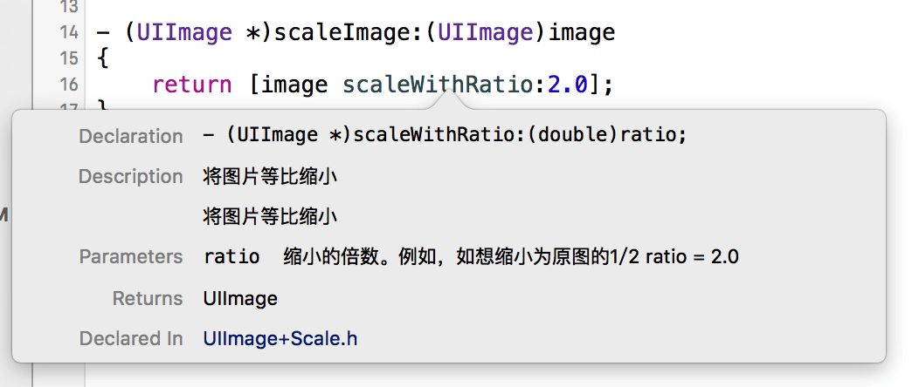
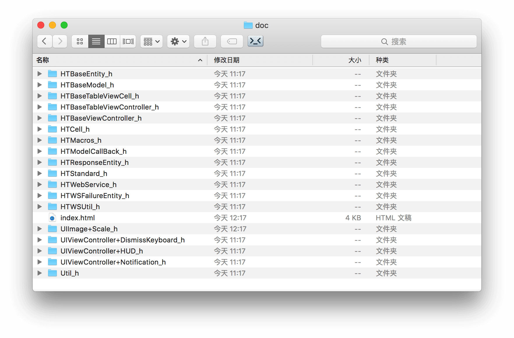
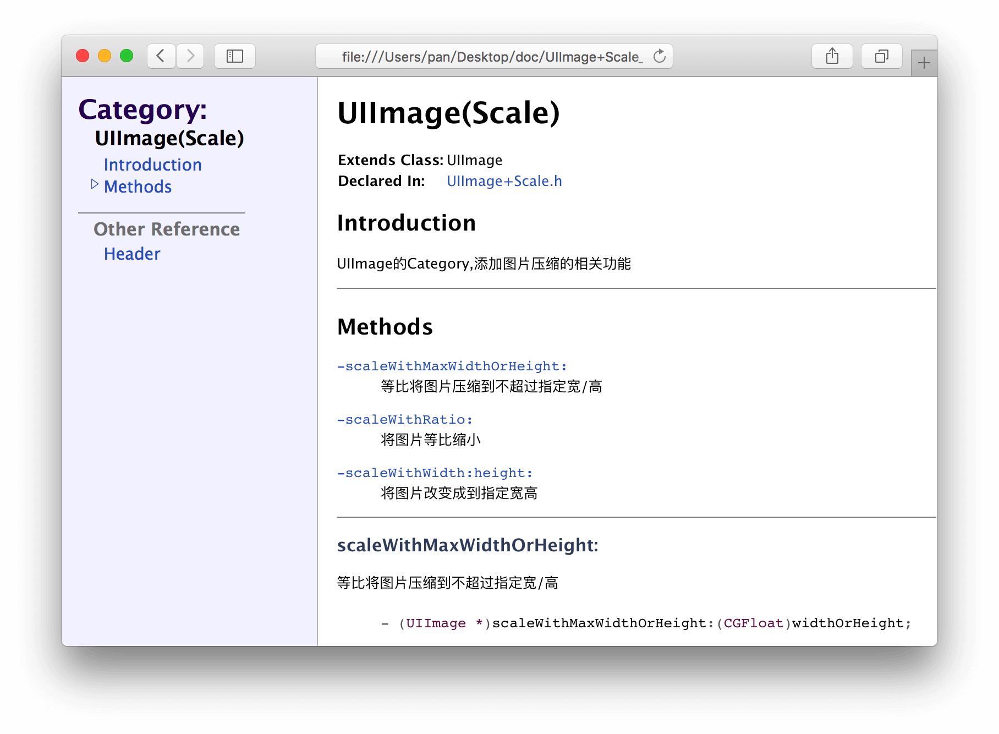
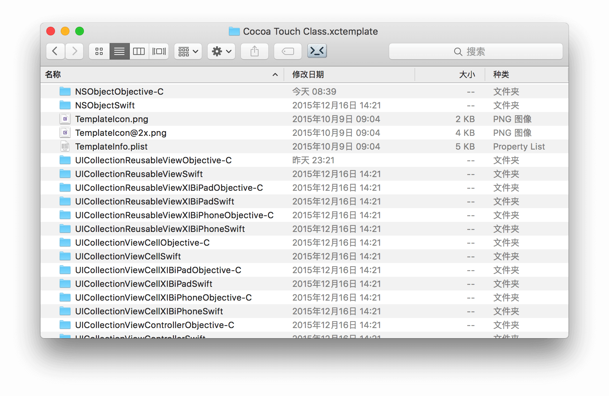
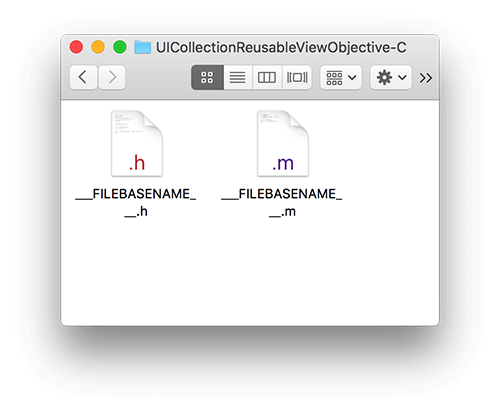
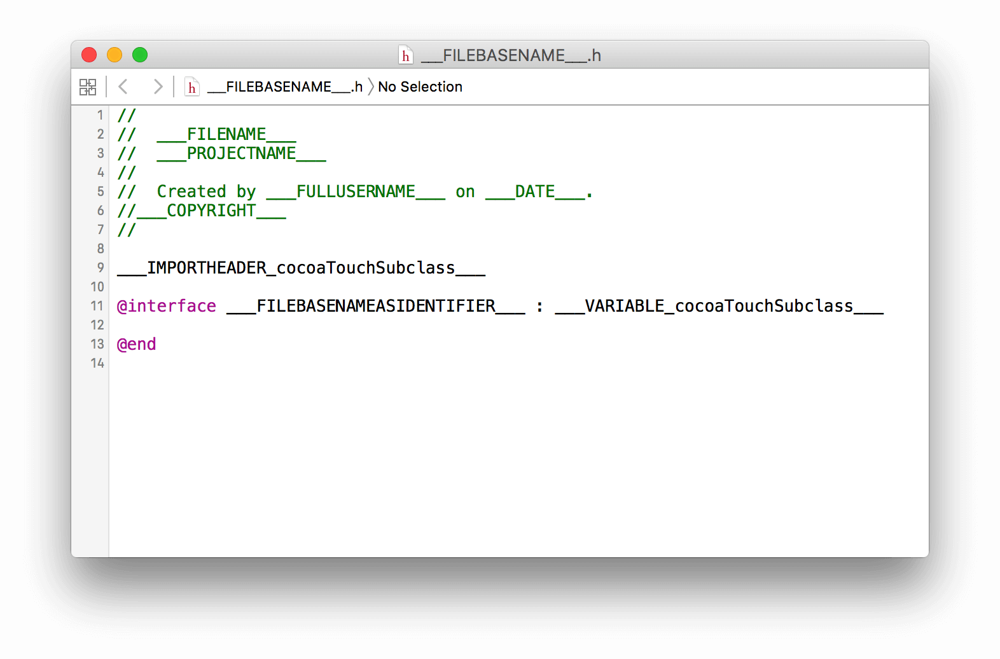
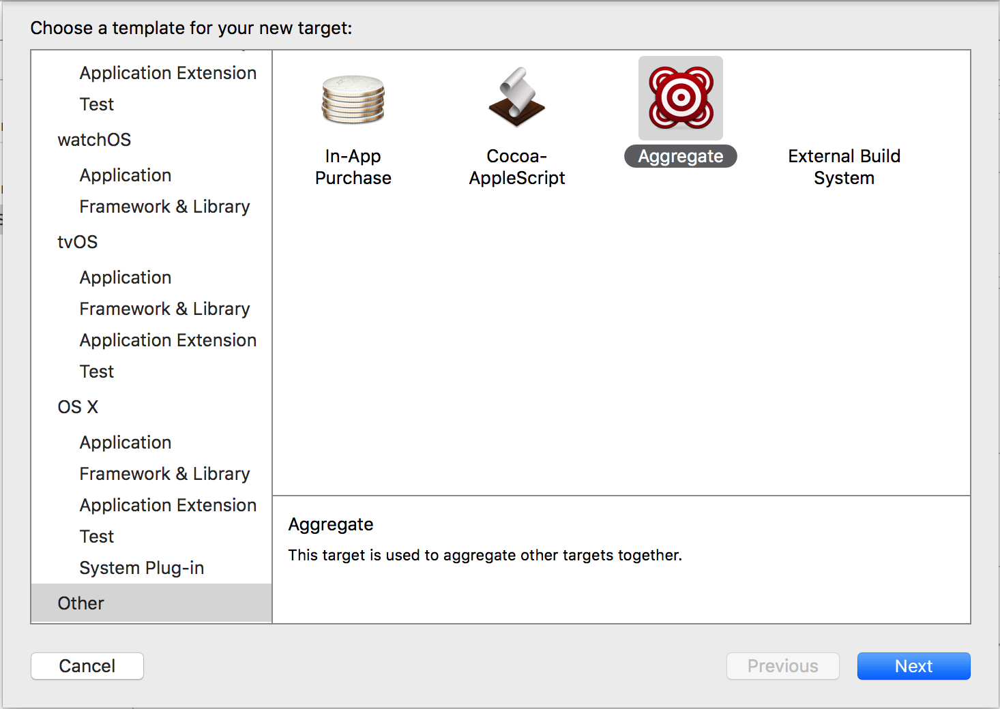
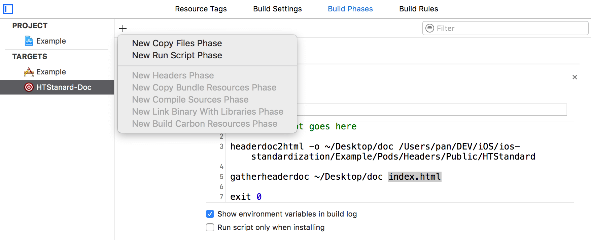

** 先贴链接：**
[利用HeaderDoc自动生成API文档](https://shengpan.net/headerdoc/)


 关于文档，业界有一些成熟的解决方案。例如评价颇高的AppleDoc，还有从Xcode 5,iOS7开始集成在Xcode中的HeaderDoc。本着一切以官方为准的原则，选择了HeaderDoc来完成这项工作。
<!--more-->
#### 用HeaderDoc有什么好处？
将鼠标移动到某一行方法上，按option+鼠标左键试试？

可以自动导出文档


居然如此炫酷，还不赶紧跟我一起用起HeaderDoc,走(tiao)上(jin)人(wen)生(dang)巅(da)峰(keng)？

#### HeaderDoc 的注释标准
HeaderDoc的注释，一般我们会用到以下几种：
##### 头文件注释
头文件基本信息。这个用在每个源代码文件的头文件的最开头。
```
/*!

 @header UIImage+Scale.h

 @abstract 图片压缩的Category

 @author Created by Pan on 16/1/24.

 @version 1.2.0 16/1/24 Creation

 */
```

* `@header` 与该源代码文件的名字一致
* `@abstract` 关于这个源代码文件的一些基本描述
* `@author` Sheng Pan (作者信息)
* `@version` 1.2.0 2012/01/20 Creation (此文档的版本信息)

##### 类注释
关于此类的一些信息。此注释用在类声明的开头。
```
/*!

@class PSCarouselView

@abstract 轮播控件，实现了常见的图片轮播功能。

*/
```
* `@class`与该类名一致

##### 方法注释
```
/*!

 @abstract 将图片等比缩小

 @discussion 将图片等比缩小,注意:此方法在主线程运行，处理大量图片请使用scaleImageOnBackgroud:

 @param ratio 缩小的倍数。例如，如想缩小为原图的1/2 ratio = 2.0

 @result UIImage

 */
 ```
 * `@discussion` 该方法的详细描述，包括方法的一些注意事项，适用情况条件等等。

##### 枚举注释
```
/*!

 @enum Gender

 @abstract 性别枚举

 @constant GenderUnknow 性别未知

 @constant GenderMale 男

 @constant GenderFemale 女

 */
 ```
* `@enum` 与枚举名称一致
* `@constant` 与枚举值一致，后面添加描述


##### Category注释
```
/*!

 @category  Scale

 @abstract  UIImage的Category,添加图片压缩的相关功能

 */
 ```

* `@category` 与Category名称一致

##### Protocol注释
```
/*!

@protocol HTModelCallBack

@abstract Model的回调接口。

@discussion 想接收Model回调的类，申明并实现此接口，即可获取从HTBaseModel中回调的信息。注意：接收回调的前提，是使用DESIGNATED_INITIALIZER来初始化HTBaseModel(或其子类).

*/
```
 * `@Protocol` 与Protocol名称一致


 常用的注释基本上就是这些，如果还需要了解更多注释的关键字请查阅[官方文档](https://developer.apple.com/library/archive/documentation/DeveloperTools/Conceptual/HeaderDoc/usage/usage.html)。

#### 自动生成标准注释

以上的注释格式如此繁琐，手工输入绝对不是我等懒鬼的作风。自动生成注释有以下几种方法

* 修改Xcode模版文件，一劳永逸。
* 利用Xode的code snapshot，快速编写注释。
* fork一份VV-Documentor-Xcode然后修改里面的注释风格。（VV-Documentor-Xcode原来的注释风格不支持导出文档）。

后两种不多做介绍，在此介绍一下修改Xcode模版文件的方法。
** 打开finder，前往如下路径 **
`/Applications/Xcode.app/Contents/Developer/Platforms/iPhoneOS.platform/Developer/Library/Xcode/Templates/File Templates/Source/Cocoa Touch Class.xctemplate`

我们会看到这样一个目录

每个文件夹下面的文件，就是各种系统类(包括你继承下来的子类)的模版文件。修改哪个文件夹下的模版文件，创建对应类(和继承自其子类的类)时，就会自动生成模版里预定的注释。

文件夹内包含了.h和.m两份文件，分别对应.h和.m文件的模版

我们打开.h模版文件，可以看到如下信息

此处有几个系统的宏

* `FILENAME`：文件名
* `PROJECTNAME`：项目名
* `FULLUSERNAME`：当前mac用户全称
* `COPYRIGHT`：版权声明


我们将头文件修改为如下格式，在创建类的时候就可以自动生成我们需要的注释格式了。
```
/*!

  @header ___FILENAME___

  @abstract <#abstract#>

  @author Created by ___FULLUSERNAME___ on ___DATE___.

  @version <#version#> ___DATE___ Creation

___COPYRIGHT___

 */

___IMPORTHEADER_cocoaTouchSubclass___

/*!

  @class ___FILEBASENAMEASIDENTIFIER___

  @abstract <#description#>

 */
@interface ___FILEBASENAMEASIDENTIFIER___ : ___VARIABLE_cocoaTouchSubclass___

@end
```
其他文件如法炮制即可。

[在 Xcode9 中自定义文件头部注释和其他文本宏](http://swift.gg/2017/12/10/Customizing-the-file-header-comment-and-other-text-macros-in-Xcode-9/)


*注意:* 记得逐一修改Cocoa Touch Class.xctemplate文件夹内每一个类的模版文件。只有修改过的类和其子类会起作用。


#### 自动导出文档。
规范的注释标好后，导出文档就很方便了。有两种方法可以导出文档。
##### 用命令行导出文档
首先输出文档
```
headerdoc2html -o DESTINATION_PATH PROJECT_PATH  
```
* `DESTINATION_PATH`：文档输出目标文件夹。如~/Desktop/documentation
* `PROJECT_PATH` ：项目目录。如~/Desktop/project

然后创建一个文档索引
```
gatherheaderdoc DESTINATION_PATH INDEX_PAGE_NAME
```
* `DESTINATION_PATH`：文档输出目标文件夹。如~/Desktop/documentation
* `INDEX_PAGE_NAME`：索引页的名字。如index.html


##### 用Xcode Build一份文档
这个方法本质上也是用命令行导出文档。无非是可以不再需要手动管理文档路径，每个项目可以对应一个文档路径。用流行的话来说，就是一次配置，到处留情。哦不，是一次配置，自动运行。

首先在你的项目中新建一个target。类型选择为Other-Aggregate。

在Target的Build-Phases中，点击加号，选择New Run Phases Script。

粘贴如下脚本（注意修改你自己的工程目录和导出目录）
```
# shell script goes here

headerdoc2html -o ~/Desktop/doc /Users/pan/DEV/iOS/ios-standardization/Example/Pods/Headers/Public/HTStandard

gatherheaderdoc ~/Desktop/doc index.html

exit 0  
```
最后，选择这个target，并Run。然后就等待奇迹的发生吧。
