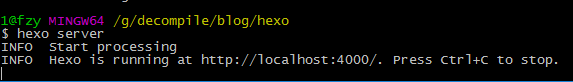
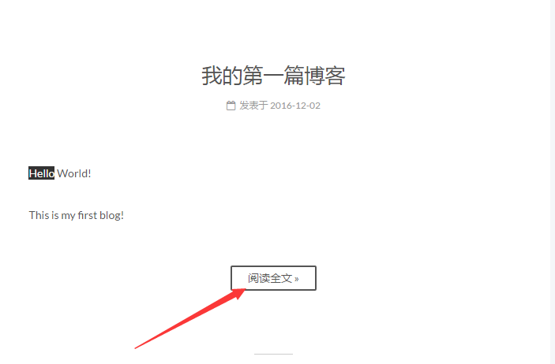
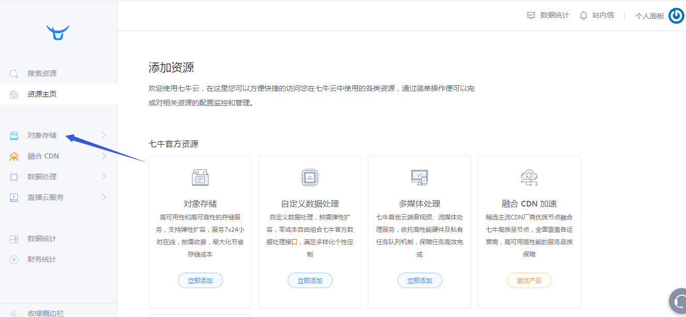
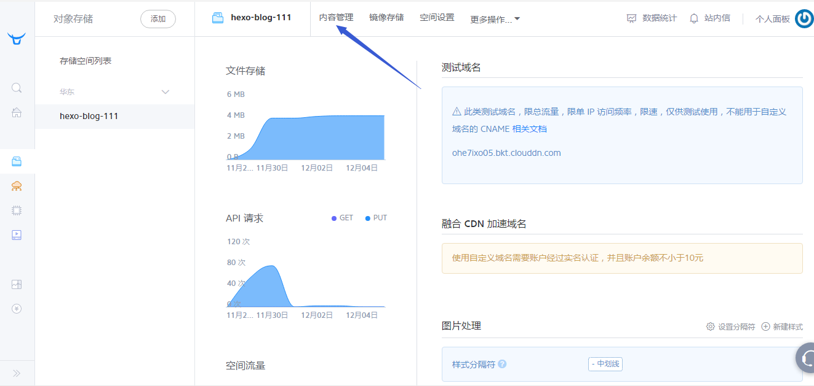
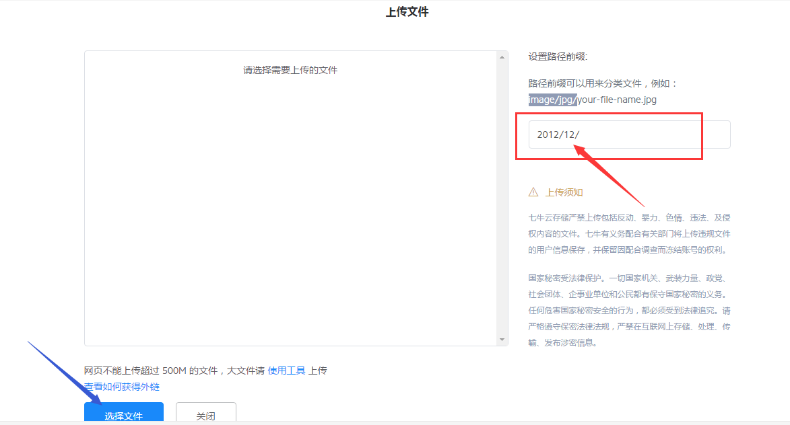
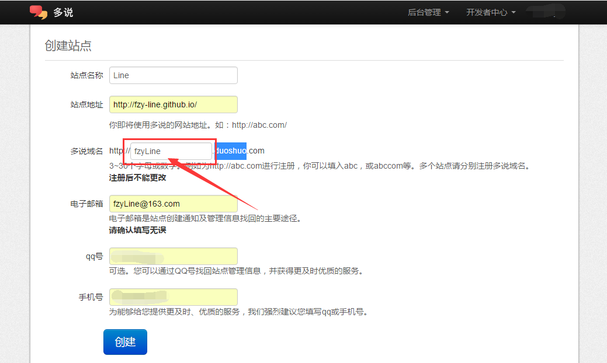
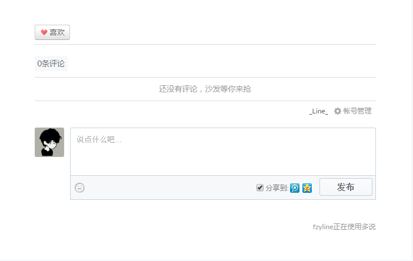
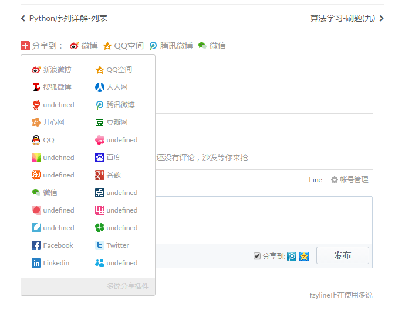
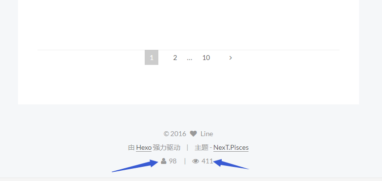
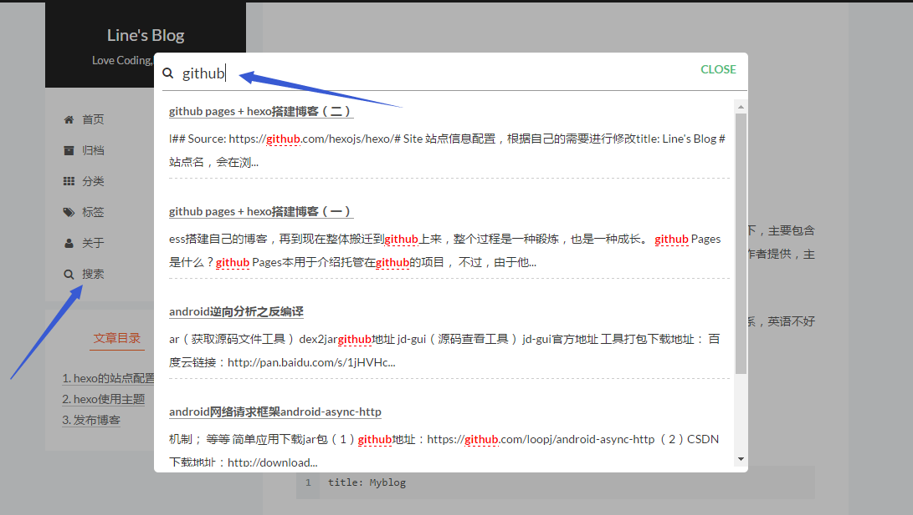

###### 先贴链接：
 [Github Pages + Hexo搭建博客（一）](http://fanzhenyu.me/2016/11/30/Github-Pages-Hexo%E6%90%AD%E5%BB%BA%E5%8D%9A%E5%AE%A2%EF%BC%88%E4%B8%80%EF%BC%89/)
[NexT官网](http://theme-next.iissnan.com/)
[https://hexo.io/](https://hexo.io/)
[hexo博客图片问题](https://www.jianshu.com/p/c2ba9533088a)
<!--more-->
## 下面为复制粘贴 略有删减 详情查看上面👆链接
----
#### 写在前面的话

阮一峰说过，喜欢写Blog的人，会经历三个阶段。

（1）第一阶段，刚接触Blog，觉得很新鲜，试着选择一个免费空间来写。

（2）第二阶段，发现免费空间限制太多，就自己购买域名和空间，搭建独立博客。

（3）第三阶段，觉得独立博客的管理太麻烦，最好在保留控制权的前提下，让别人来管，自己只负责写文章。

我自己就是从一开始在CSDN写，后来租用阿里云的服务器，用WordPress搭建自己的博客，再到现在整体搬迁到Github上来，整个过程是一种锻炼，也是一种成长。

##### GitHub Pages是什么？

GitHub Pages本用于介绍托管在GitHub的项目， 不过，由于他的空间免费稳定，用来做搭建一个博客再好不过了。

##### 为什么选择GitHub Pages？

* GitHub Pages有300M免费空间，搭建的博客可以很方便的进行管理，并且保存可靠；
* GitHub 是趋势，GitHub上面有很多大牛，学IT的人应该尽早融入这样的环境，
* 程序员应该学会使用Git来管理项目，熟悉版本控制。
* Github上有很多的开源项目，多学习学习，眼界会开阔很多；

##### 接下来应该怎么做？

Hexo 是一个简单地、轻量地、基于Node的一个静态博客框架，可以方便的生成静态网页托管在github。我们要使用Github Pages + Hexo搭建博客站点，就必须注册Github账号，安装git、node.js以及hexo等，接下来就一起来实践吧！

#### Github配置

在自己的Github主页，新建一个仓库:yourname.github.io(yourname与你的注册用户名一致,这个就是你博客的域名了)

至此，我们已经配置好了github默认的静态站点，并且可以访问：你的github用户名.github.io测试我们刚刚建立好的站点主页。

#### 下载并安装Git

##### 下载

根据自己电脑操作系统的位数到git官网下载相应的版本：[https://git-scm.com/download/win](https://git-scm.com/download/win)

##### 安装

根据自己的需要安装到相应的路径下，其他的一路点击next即可

##### 配置环境变量

选中桌面图标计算机，右键选择属性，打开左边的高级系统设置，打开弹出窗口的环境变量，找到path进行编辑。

找到git的安装目录，将其复制后粘贴到path后面。注意每一个加进来的路径后面都要带英文格式的分号。

安装与配置过程可参考图文教程：[git的安装和配置](http://jingyan.baidu.com/article/9f7e7ec0b17cac6f2815548d.html)

#### 测试是否安装成功

windows+R输入cmd打开命令提示符窗口，输入如下命令：
```
git --version
```
若安装成功会打印出本机安装的git的版本。

##### 添加SSH KEY到Github

SSH Key是一个认证，让github识别绑定这台机器，允许这台机器提交。

**（1）检查本机是否有SSH KEY设置**

打开git bash，输入cd ~/.ssh 或cd .ssh

如果没有则提示： No such file or directory

如果有则进入~/.ssh路径下（ls查看当前路径文件，rm * 删除所有文件）

**（2）配置生成SSH KEY**
```
$ cd ~  #保证当前路径在”~”下

$ ssh-keygen -t rsa -C "这里填写你的邮箱地址"

Generating public/private rsa key pair.

Enter file in which to save the key (/c/Users/xxxx_000/.ssh/id_rsa):   #不填直接回车

Enter passphrase (empty for no passphrase):   #输入密码（可以为空）

Enter same passphrase again:   #再次确认密码（可以为空）

Your identification has been saved in /c/Users/xxxx_000/.ssh/id_rsa.   #生成的密钥

Your public key has been saved in /c/Users/xxxx_000/.ssh/id_rsa.pub.  #生成的公钥

The key fingerprint is:

e3:51:33:xx:xx:xx:xx:xxx:61:28:83:e2:81 xxxxxx@yy.com
```

至此，已经生成ssh key，其存放路径为：c:/Users/你电脑的用户名/.ssh/下。

注释：可生成ssh key自定义名称的密钥，默认id_rsa。

**（3）复制SSH KEY到Github**

到C盘你的用户目录下找到.ssh文件夹，查看里面是否有id_rsa和id_rsa.pub这两个文件。

登录GitHub系统；点击右上角账号头像的“▼”→Settings→SSH kyes→Add SSH key，Title自定义，复制id_rsa.pub的公钥内容到GitHub中Add an SSH key的key输入框，最后“Add Key”。

**（4）配置账户**

```
$ git config --global user.name “your_username”  #设置用户名

$ git config --global user.email “your_registered_github_Email”

#设置邮箱地址(建议用注册giuhub的邮箱)
```

**（5）测试SSH KEY是否设置成功**

```
$ ssh -T git@github.com
```

接下来会返回一些信息，并需要你输入一次yes，若生成ssh key时设置有密码则还会让你输入生成ssh key时设置的密码。

Hi xxx! You’ve successfully authenticated, but GitHub does not provide shell access. #出现词句话，说明设置成功。

SSH-KEY的生成与配置可参考图文教程[window下配置SSH连接GitHub、GitHub配置ssh key：](http://jingyan.baidu.com/article/a65957f4e91ccf24e77f9b11.html)

#### 下载并安装node.js

##### 下载

根据自己电脑操作系统的位数到git官网下载相应的版本： [https://nodejs.org/en/download/](https://nodejs.org/en/download/)

##### 安装

根据自己的需要安装到响应的地方，其他的一路点击next即可

##### 配置环境变量

选中桌面图标计算机，右键选择属性，打开左边的高级系统设置，打开弹出窗口的环境变量，找到path进行编辑。

找到node.js的安装目录，将其复制后粘贴到path后面。注意每一个加进来的路径后面都要带英文格式的分号。

#### 测试是否安装成功

windows+R输入cmd打开命令提示符窗口，输入如下命令：
```
node -v
```
若安装成功会打印出本机安装的node.js的版本。

#### 安装和配置hexo

hexo是基于node.js的静态博客，官网也是搭建在GitHub上。

##### 安装

在你喜欢的路径下新建一个文件夹blog，用来存放博客的文件，在此文件夹中右键打开Git Bash

输入如下指令进行安装：
```
$ npm install -g hexo-cli
如果出现没有权限的错误提示使用sudo
$ sudo npm install -g hexo-cli
```
如果执行这条命令时长时间未成功，那么请先使用下面的命令将npm镜像源更改为国内的镜像，再执行上面的安装命令，因为国外的镜像源很有可能被墙了。
```
npm config set registry https://registry.npm.taobao.org
```

##### 初始化hexo
```
$ hexo init hexo
```
这里会将Github上的hexo项目clone下来，得到hexo文件夹。
初始化成功后会在最后打印一行：INFO Start blogging with Hexo!

##### 安装依赖文件

进入到hexo文件夹
```
$ cd hexo
```
安装依赖文件：
```
$ npm install
```

部署形成文件：
```
$ hexo generate
```

本地测试
```
$ hexo server
```


在浏览器输入：[http://localhost:4000/](http://localhost:4000/) 即可访问到我们搭建好的hexo站点。

#### 将本地hexo项目托管到Github

##### 修改全局配置文件_config.yml

**说明：** hexo文件夹下一个_config.yml，我们称之为全局配置文件，在每个主题文件夹内还会有一个_config.yml文件，我们称之为主题配置文件。

用sublime text3或者notepad++等编辑器打开hexo文件夹下的_config.yml文件。

**注意：配置文件中每个字段后面的冒号是英文格式的，且在其后要加一个空格再写值**

编辑最后面的deploy属性，加入代码：
```
type: git

repository: https://github.com/你的Github用户名/你的Github用户名.github.io.git

branch: master
```
type使用是git。
repository属性改成你的刚才创建仓库git地址。
分支branch填写master
注意：deploy后面的属性要有缩进

##### 安装hexo-deployer-git插件
```
$ npm install hexo-deployer-git --save
```

##### 部署到Github上

依次执行以下三条命令：
```
$ hexo clean  #清除缓存 网页正常情况下可以忽略此条命令
$ hexo generator  #生成静态页面至public目录
$ hexo deploy  #将.deploy目录部署到GitHub
```

执行hexo deploy命令之后，如果最后一行打印出如下信息则表示部署成功
```
INFO  Deploy done: git
```
然后你再去访问你创建的Github pages地址，也就是：你的Github用户名.github.io，即可看到你本地的hexo项目已经被部署到github上去了。此时博客的默认主题是landscape，即上面本地测试时的样子。

----
## 下面讲解Hexo的站点配置、主题配置和使用以及博客文章的发布

在Hexo中有两份主要的配置文件，其名称都是_config.yml。其中，一份位于站点根目录下，主要包含Hexo本身的配置,我们称之为**全局配置文件**；另一份位于主题目录下，这份配置由主题作者提供，主要用于配置主题相关的选项,我们称之为**主题配置文件**。

hexo的官方网站：https://hexo.io/，里面有hexo的详细说明文档，不过是英文的。没关系，英语不好的请往下看。

**注意：配置文件中每个字段后面的冒号是英文格式的，且在其后要加一个空格再写值**
比如：

      title: Myblog

hexo的站点配置
编辑hexo目录下的_config.yml文件，具体配置如下：
```
# Hexo Configuration
## Docs: https://hexo.io/docs/configuration.html
## Source: https://github.com/hexojs/hexo/
# Site 站点信息配置，根据自己的需要进行修改
title: Line's Blog    #站点名，会在浏览器页面标签左上角显示
subtitle: Love Coding,Enjoy Life  #副标题
description: fzy-line  #Â
author: Line  #网站作者
language: zh-Hans  #网站语言
timezone: Asia/Shanghai  #时区
avatar: /images/logo.jpg  #网站logo，会在浏览器页面标签左上角显示
# URL 博客地址,与申请的GitHub一致
## If your site is put in a subdirectory, set url as 'http://yoursite.com/child' and root as '/child/'
url: https://fzy-line.github.io/
root: /
#博客链接格式
permalink: :year/:month/:day/:title/
permalink_defaults:
# Directory  #目录设置，一般不修改
source_dir: source  #资源文件夹，放在里面的文件会上传到github中
public_dir: public  #公共文件夹，存放生成的静态文件
tag_dir: tags  #标签文件夹，默认是tags。实际存放在source/tags中。
archive_dir: archives  #档案文件夹，默认是archives。
category_dir: categories  #分类文件夹，默认是categories。实际存放在source/categories中。
code_dir: downloads/code  #代码文件夹，默认是downloads/code
i18n_dir: :lang  #国际化文件夹，默认跟language相同
skip_render:  #跳过指定文件的渲染，您可使用 glob 来配置路径。
# Writing  这是文章布局、写作格式的定义，一般不修改
new_post_name: :title.md # File name of new posts
default_layout: post
titlecase: false # Transform title into titlecase
external_link: true # Open external links in new tab
filename_case: 0
render_drafts: false
post_asset_folder: false
relative_link: false
future: true
highlight:
  enable: true
  line_number: true
  auto_detect: false
  tab_replace:
# Category & Tag  #分类和标签，一般不修改
default_category: uncategorized
category_map:
tag_map:
# Date / Time format  #日期、时间格式，一般不修改
## Hexo uses Moment.js to parse and display date
## You can customize the date format as defined in
## http://momentjs.com/docs/#/displaying/format/
date_format: YYYY-MM-DD
time_format: HH:mm:ss
# Pagination  #可根据自己需要修改
## Set per_page to 0 to disable pagination
per_page: 6  #分页，每页文章数量
pagination_dir: page
# Extensions  #扩展
## Plugins: https://hexo.io/plugins/
## Themes: https://hexo.io/themes/
theme: next  #博客主题

# Deployment 这里配置站点部署到Github，上一节中已经讲过
## Docs: https://hexo.io/docs/deployment.html
deploy:
  type: git
  repository: git@github.com:你的Github用户名.github.io.git
  branch: master
```
##### hexo使用主题
Hexo 安装主题的方式非常简单，只需要将主题文件拷贝至站点目录的 themes 目录下， 然后修改下配置文件即可。

hexo官方主题下载地址：https://hexo.io/themes/, 里面有多种多样的主题模板供大家选择。

这里推荐一款很火的主题：next，下面的配置也是以这个主题为例。如果你使用的是其他的主题，那么请你自己根据说明文档进行配置。

next主题的官网，有很详细的配置文档：http://theme-next.iissnan.com/

##### 下载主题
next下载地址：https://github.com/iissnan/hexo-theme-next

到Gtihub下载此主题后解压，打开可以看到里面很多主题相关的文件，我们将此文件夹改名为next，然后将它复制到站点目录的/themes/目录下。

##### 启用主题
hexo默认是使用的landscape主题，我们可以在站点目录下的/themes/目录下看到landscape文件夹。

我们的themes文件夹里可以放很多主题的文件夹，但是实际上我们的网站采用哪一个主题，这是需要我们进行配置的，打开编辑全局配置文件，找到下面的内容：
```
# Extensions  #扩展
## Plugins: https://hexo.io/plugins/
## Themes: https://hexo.io/themes/
theme: next  #博客主题，默认是landscape
```
在theme字段这里填上你下载的主题的文件夹的名字，例如我们使用next主题就填上next。这样配置文件就和我们的主题文件关联起来了。

##### 配置主题配置文件
主题配置文件位于站点目录下的/themes/next/目录下，打开编辑，这里我们只贴出需要修改的地方进行介绍，如下：

**（1）配置基本信息**
```
# 网站图标，将其放在hexo站点/source/目录下
favicon: /logo.jpg
# 关键词，例如下面是我写的
keywords: "Python,Life,Android"
# 网站建立时间，显示在页面底部
since: 2016
# 网站版权声明，显示在页面底部
copyright: true
```
**（2）选择外观样式**

目前 NexT 支持三种 Scheme，他们是：
Muse - 默认 Scheme，这是 NexT 最初的版本，黑白主调，大量留白
Mist - Muse 的紧凑版本，整洁有序的单栏外观
Pisces - 双栏 Scheme，小家碧玉似的清新
找到主题配置文件的如下三行，其中#号表示注释，要启用哪一种样式就把#号去掉即可。
```
# Schemes
#scheme: Muse
#scheme: Mist
scheme: Pisces
```
**（3）设置菜单**

菜单内容的设置格式是：item name: link。其中 item name 是一个名称，这个名称并不直接显示在页面上，它将用于匹配图标以及翻译。
```
menu:
  home: /
  archives: /archives
  categories: /categories
  tags: /tags
  about: /about
  #sitemap: /sitemap.xml
  #commonweal: /404.html
```
此设定格式是 item name: icon name，其中 item name 与上一步所配置的菜单名字对应，icon name 是 Font Awesome 图标的 名字。而 enable 可用于控制是否显示图标，你可以设置成 false 来去掉图标。
```
menu_icons:
  enable: true
  #KeyMapsToMenuItemKey: NameOfTheIconFromFontAwesome
  home: home
  about: user
  categories: th
  schedule: calendar
  tags: tags
  archives: archive
  sitemap: sitemap
  commonweal: heartbeat
```
##### 测试配置效果
```
$ hexo clean #用于清除缓存
$ hexo generate #生成静态网页
$ hexo server #开启本地预览
```
访问：http://localhost:4000/ 查看效果

2-3

##### 解决遇到的问题
到这里会发现点击左侧菜单的分类、标签和关于会提示找不到页面。
这是因为我们只是创建了菜单，还没有创建相应的页面。
新建页面的hexo命令是：
```
$ hexo new page "pageName"
```
我们新建分类、标签、关于页面：
```
$ hexo new page 'categories'
$ hexo new page 'tags'
$ hexo new page 'about'
```
分别执行完这三条命令后，我们会发现站点目录下的/source/目录下多了三个文件夹：categories，tags，about，每个文件夹里面都会生成一个index.md文件，如下：

默认都只会生成title和date字段，我们要为其添加上type字段，并赋值。

**注意：博客文章的抬头信息中每个字段后面的冒号是英文格式的，而且其后要加一个空格再写值**

categories下的index.md：
```
---
title: categories
date: 2016-12-02 23:28:27
type: categories
---
```
tags下的index.md：
```
---
title: tags
date: 2016-12-02 23:31:23
type: tags
---
```
about下的index.md：
```
---
title: about
date: 2016-12-02 23:31:23
type: about
---
```
这样我们的这几个页面也就没有问题了。至此，基本的配置也就完成了，接下来介绍如何写博客与发布博客。

#### 发布博客
##### 新建博客文章
```
$ hexo new "postName" #新建文章
```
实例：

新建博客《我的第一篇博客》
```
$ hexo new "我的第一篇博客"
```
到站点目录下的/source/posts 目录下可以看到生成了名为：我的第一篇博客.md的文件，这是Markdown格式的文件，可以用sublime text3或者notepad++等编辑器打开，也可以下载一个MarkdownPad来编辑Markdown文件。

Markdown是一种可以使用普通文本编辑器编写的标记语言，通过简单的标记语法，它可以使普通文本内容具有一定的格式。

如果你没有使用过Markdown编辑器，那请你自己去学习一下Markdown语法。

Markdown 语法说明(简体中文版)：http://www.appinn.com/markdown/

##### 编辑博客
Hexo默认新建的文章抬头已有title、date、tags等属性，可能缺乏categories和meta标签，想要指定目录就需要添加categories属性，而meta标签则是为了便于搜索引擎的收录。如下：
```
---
title: 我的第一篇博客
date: 2016-12-02 23:44:20
tags: #文章标签 可以省略
---
```
tags字段是文章的标签，可以指定标签也可以不指定，如果要指定多个标签需要这样做：
```
tags: [Linux,Http,网络]
```
我们可以添加上categories字段，对博客进行分类管理，然后点击主页左侧菜单的分类就可看到具体的分类。例如：
```
categories: Linux
```


如何实现上图的阅读全文功能？

在文章的任意自己喜欢的位置添加一个：
```
<!--more-->
```
即可，主题会自动识别这个标签，生成对应的阅读全文按钮。
```
以上是文章摘要
<!--more-->
以下是余下全文
```
##### 发布博客
```
$ hexo clean  #清除缓存 网页正常情况下可以忽略此条命令
$ hexo generate  #生成静态页面至public目录
```
写好之后可以现在本地预览，确定无误之后再部署到Github上。
```
$ hexo server  #开启预览访问端口（默认端口4000，'ctrl + c'关闭server）
$ hexo deploy  #将.deploy目录部署到GitHub
```
需要说明的是：

我们博客文章的编写都是Markdown文件，但是发布到github上的其实是html文件，将Markdown转换成html这个工作我们只要输入hexo generate命令即可，hexo会帮我们完成转换。

**hexo命令简写形式**
```
hexo n "我的博客" == hexo new "我的博客"
hexo g == hexo generate
hexo s == hexo server
hexo d == hexo deploy
```

----
## 下面主要介绍了自己的博客站点所使用的一些第三方服务的配置

#### 博客图片存放
Markdown编辑器支持插入图片，可以直接给出图片的链接，因此我们可以将图片存放在我们hexo项目的目录下，再填写对应的路径，也可以将其存放在云服务器上，然后给出链接。

在这里，我们介绍使用七牛云来进行图片托管。七牛云是国内领先的企业级云服务商,致力于打造以数据为核心的场景化PaaS服务，图片加载速度还不错，一般也不会出现图片挂掉的情况。

##### 注册账号
注册申请一个个人账号，然后激活邮箱完成注册。

官网地址：http://www.qiniu.com/

##### 存储图片
1. 点击左侧菜单的对象存储

2. 点击上端的添加来创建存储空间
3. 填写好基本信息，点击确定创建
4. 来到新创建的存储空间，点击内容管理

5. 在内容管理中可以看到文件列表，点击上传文件
6. 可以设置上传的文件的前缀，以便进行分类管理

7. 点击关闭，回到内容管理页面查看上传的文件，复制图片链接

至此，我们就将我们博客需要的图片存储到了七牛云，然后我们只要将复制的图片链接插入到博客人文章中即可显示图片，感觉显示速度还是蛮快的。

#### 配置第三方服务
##### 多说社会化评论
（1）多说创建站点

多说官网：http://duoshuo.com/

登录多说官网，点击主页的我要安装来到创建站点页面填写基本信息：

点击创建后出现：服务异常,请联系客服人员的错误不是因为真的出现异常，而是你填写的用户名或者其他信息不符合他的要求，只是他没有提示你，这是需要注意的地方。比如我遇到的是用户名不能使用‘-’中划线和‘_ '下划线，或者多说域名填写格式错误。

（2）创建站点完成后在全局配置文件中新增duoshuo_shortname字段。

值设置成上一步中填写的值（红色方框框出部分的值）

例如：
```
duoshuo_shortname: fzyLine
```
（3）实现效果


多说分享
多说分享必须与多说评论同时使用

编辑全局配置文件，添加字段 duoshuo_share，值为 true。

##### 多说分享服务
```
duoshuo_share: true
```
实现效果：


##### 不蒜子统计
编辑全局配置文件中的busuanzi_count的配置项。

当enable: true时，代表开启全局开关。若site_uv、site_pv、page_pv的值均为false时，不蒜子仅作记录而不会在页面上显示。
```
busuanzi_count:
  # count values only if the other configs are false
  enable: true
  # custom uv span for the whole site
  site_uv: true
  site_uv_header: <i class="fa fa-user"></i>    #如果使用默认的，会显示图标
  site_uv_footer:
  # custom pv span for the whole site
  site_pv: true
  site_pv_header: <i class="fa fa-eye"></i>     #如果使用默认的，会显示图标
  site_pv_footer:
  # custom pv span for one page only
  page_pv: true
  page_pv_header: <i class="fa fa-file-o"></i>  #如果使用默认的，会显示图标
  page_pv_footer:
```
实现效果：


可以修改成如下的样子：

当site_uv: true时，代表在页面底部显示站点的UV值。即访客数：
```
# 效果：本站访客数12345人次
site_uv: true
site_uv_header: 本站访客数
site_uv_footer: 人次
```
当site_pv: true时，代表在页面底部显示站点的PV值。即总访问量：
```
# 效果：本站总访问量12345次
site_pv: true
site_pv_header: 本站总访问量
site_pv_footer: 次
```
当page_pv: true时，代表在文章页面的标题下显示该页面的PV值（阅读数）。
```
# 效果：本文总阅读量12345次
page_pv: true
page_pv_header: 本文总阅读量
page_pv_footer: 次
```
##### 站内搜索
next主题的官方文档提供了几种实现搜索服务的方式，我们就使用配置最简单的Local Search，添加百度/谷歌/本地 自定义站点内容搜索。

（1）安装 hexo-generator-searchdb，在站点目录下执行以下命令：
```
$ npm install hexo-generator-searchdb --save
```
（2）编辑全局配置文件，新增以下内容到任意位置：
```
search:
  path: search.xml
  field: post
  format: html
  limit: 10000
````
（3）实现效果：

##### 开启打赏功能
next主题开启打赏功能很简单，我们只需要在全局配置文件中填入微信和支付宝收款二维码图片地址即可开启该功能。先到微信和支付宝将自己收款二维码图片保存，我们同样可以将其存在七牛云上，然后贴到下面的配置文件里。
```
reward_comment: 坚持原创技术分享，您的支持将鼓励我继续创作！
wechatpay: 微信当面付图片的url
alipay: 支付宝当面付图片的url
```

实现效果：

Github pages + Hexo搭建静态博客站点的系列文章到这里就完结了，其实也算是一个很详细的教程了，花了一些时间来整理。之后可能不会再更新，但是，如果之后遇到一些问题或者有更好的推荐，可能还会再写。
